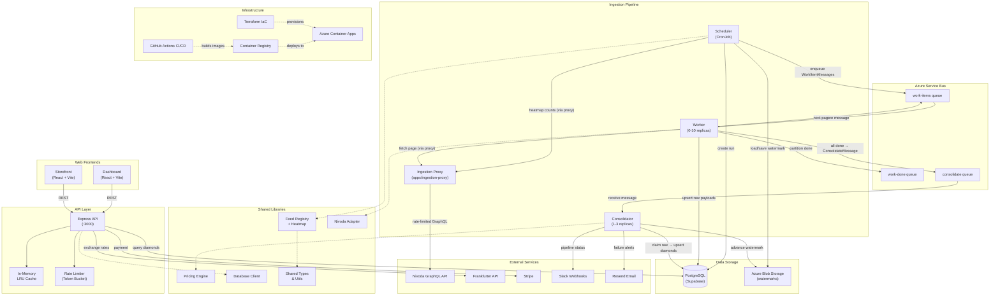
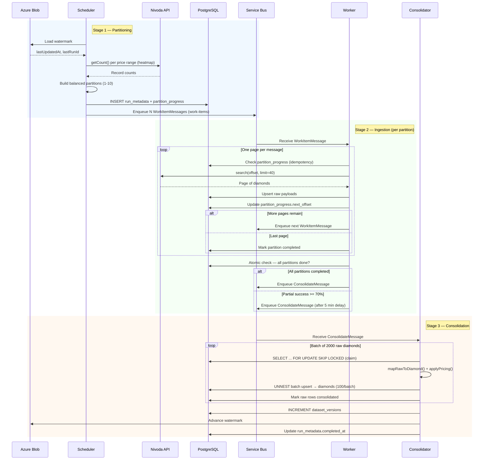

# Architecture Diagrams

Visual Mermaid diagrams for the Diamond Opus system architecture, database design, and ingestion pipeline.

---

## 1. System Architecture



---

## 2. Database Schema

```mermaid
erDiagram
    diamonds {
        uuid id PK
        text feed
        text supplier_stone_id UK
        text offer_id
        text shape
        numeric carats
        text color
        text clarity
        text status
        text availability
        numeric feed_price
        numeric price_model_price
        numeric price_per_carat
        numeric markup_ratio
        integer rating
        integer pricing_rating
        boolean lab_grown
        timestamptz created_at
        timestamptz updated_at
    }

    raw_diamonds_nivoda {
        uuid id PK
        uuid run_id FK
        text supplier_stone_id UK
        text offer_id
        jsonb payload
        text payload_hash
        boolean consolidated
        text consolidation_status
        timestamptz claimed_at
        text claimed_by
    }

    raw_diamonds_demo {
        uuid id PK
        uuid run_id FK
        text supplier_stone_id UK
        text offer_id
        jsonb payload
        text payload_hash
        boolean consolidated
        text consolidation_status
        timestamptz claimed_at
        text claimed_by
    }

    run_metadata {
        uuid run_id PK
        text feed
        text run_type
        integer expected_workers
        integer completed_workers
        integer failed_workers
        integer consolidation_processed
        integer consolidation_errors
        timestamptz started_at
        timestamptz completed_at
    }

    partition_progress {
        uuid run_id PK_FK
        text partition_id PK
        integer next_offset
        boolean completed
        boolean failed
        timestamptz updated_at
    }

    worker_runs {
        uuid id PK
        uuid run_id FK
        text partition_id UK
        uuid worker_id
        text status
        integer records_processed
        text error_message
    }

    pricing_rules {
        uuid id PK
        integer priority
        text stone_type
        numeric price_min
        numeric price_max
        text feed
        numeric margin_modifier
        integer rating
        boolean active
    }

    pricing_reapply_jobs {
        uuid id PK
        text status
        integer total_diamonds
        integer processed_diamonds
        integer failed_diamonds
        text trigger_type
        uuid triggered_by_rule_id FK
        timestamptz started_at
        timestamptz completed_at
    }

    pricing_reapply_snapshots {
        uuid job_id PK_FK
        uuid diamond_id PK
        numeric old_price_model_price
        numeric new_price_model_price
    }

    rating_rules {
        uuid id PK
        integer priority
        boolean active
        integer rating
        text feed
        numeric price_min
        numeric price_max
    }

    rating_reapply_jobs {
        uuid id PK
        text status
        integer total_diamonds
        integer processed_diamonds
        integer updated_diamonds
        uuid triggered_by_rule_id FK
        text trigger_type
    }

    rating_reapply_snapshots {
        uuid job_id PK_FK
        uuid diamond_id PK
        integer old_rating
        integer new_rating
    }

    purchase_history {
        uuid id PK
        uuid diamond_id FK
        text feed
        text offer_id
        text idempotency_key UK
        text status
        text order_number
        text payment_status
        text stripe_checkout_session_id
        integer amount_cents
    }

    hold_history {
        uuid id PK
        uuid diamond_id FK
        text feed
        text offer_id
        text status
        boolean denied
        timestamptz hold_until
    }

    api_keys {
        uuid id PK
        text key_hash UK
        text client_name
        boolean active
        timestamptz last_used_at
    }

    dataset_versions {
        text feed PK
        bigint version
        timestamptz updated_at
    }

    demo_feed_inventory {
        uuid id PK
        text stone_id UK
        numeric weight_ct
        text stone_shape
        numeric asking_price_usd
        text availability_status
    }

    exchange_rates {
        uuid id PK
        text base_currency UK
        text target_currency UK
        numeric rate
        date rate_date
    }

    error_logs {
        bigint id PK
        varchar service
        text error_message UK
        jsonb context
        timestamptz created_at
    }

    rate_limit {
        text key PK
        timestamptz window_start
        integer request_count
    }

    %% Pipeline relationships
    run_metadata ||--o{ raw_diamonds_nivoda : "run_id"
    run_metadata ||--o{ raw_diamonds_demo : "run_id"
    run_metadata ||--o{ partition_progress : "run_id"
    run_metadata ||--o{ worker_runs : "run_id"

    %% Transaction relationships
    diamonds ||--o{ purchase_history : "diamond_id"
    diamonds ||--o{ hold_history : "diamond_id"

    %% Pricing reapply relationships
    pricing_rules ||--o{ pricing_reapply_jobs : "triggered_by_rule_id"
    pricing_reapply_jobs ||--o{ pricing_reapply_snapshots : "job_id"

    %% Rating reapply relationships
    rating_rules ||--o{ rating_reapply_jobs : "triggered_by_rule_id"
    rating_reapply_jobs ||--o{ rating_reapply_snapshots : "job_id"
```

---

## 3. Ingestion Pipeline



---

## Notes

- **System Architecture**: Dashed lines (-.->)  show package dependencies; solid lines show runtime data flow.
- **Ingestion Proxy**: `apps/ingestion-proxy` is a standalone Express service (separate from the main API) that rate-limits and proxies Nivoda GraphQL calls. Workers and the scheduler route through it via `NIVODA_PROXY_BASE_URL`.
- **Database Schema**: Only key columns are shown per table. See `sql/full_schema.sql` and `sql/migrations/` for complete definitions. Tables added via migrations (e.g. `dataset_versions`, `rating_rules`, `pricing_reapply_jobs`) are included.
- **Pipeline Sequence**: Shows the happy path. On failure, watermark is not advanced and alerts are sent via Resend/Slack.
