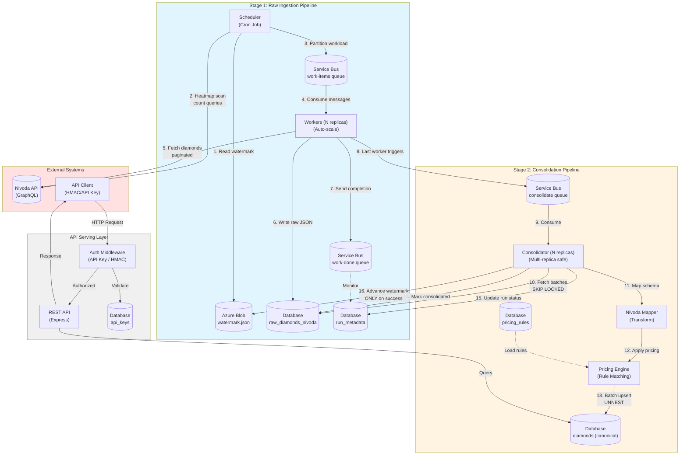

# Data Flow Diagram (End-to-End)

This diagram shows how data flows through the entire system from ingestion to API serving.



## Data Transformations

### 1. Raw Ingestion (Workers)
- **Input**: Nivoda GraphQL response (JSON)
- **Output**: Raw JSON stored in `raw_diamonds_nivoda.payload`
- **Transformation**: None (raw storage)
- **Keys**:
  - `offer_id` = `items[].id` (for ordering)
  - `supplier_stone_id` = `items[].diamond.id` (for deduplication)

### 2. Schema Mapping (Consolidator → Mapper)
- **Input**: Raw Nivoda payload
- **Output**: Canonical diamond schema
- **Transformation**: Field mapping, unit conversion, normalization
- **Example**:
  ```typescript
  // Nivoda → Canonical
  payload.diamond.measurements.length → measurements.length (mm)
  payload.diamond.supplierName → supplier_name
  payload.price.total → feed_price (dollars, DECIMAL)
  ```

### 3. Pricing Application (Pricing Engine)
- **Input**: Base diamond with `feed_price`
- **Output**: Diamond with applied pricing rules
- **Transformation**: Rule matching by priority, markup calculation
- **Formula**: `price_model_price = feed_price * markup_multiplier`
- **Rules Match**: shape, color, clarity, carat range, cut (priority: lower = higher precedence)

### 4. Database Upsert (Consolidator)
- **Input**: Array of canonical diamonds (100/batch)
- **Output**: PostgreSQL UNNEST batch insert
- **Conflict Resolution**: `ON CONFLICT (supplier_stone_id) DO UPDATE`
- **Soft Delete**: Diamonds not in new run → `status = 'deleted'`, `deleted_at = NOW()`

## Data Volume & Performance

| Stage | Volume | Batch Size | Throughput |
|-------|--------|------------|------------|
| Heatmap Scan | 500K records | 3 concurrent queries | ~30-60 API calls |
| Worker Ingestion | 5K/worker | 30 items/page | ~5-10 min (30 workers) |
| Consolidation | 500K records | 2K fetch, 100 upsert | ~4-6 min (1 replica)<br/>~1-2 min (3 replicas) |

## Failure Handling

- **Worker Failure**: Skip consolidation, do NOT advance watermark
- **Consolidation Failure**: Send email alert, do NOT advance watermark
- **Watermark Rollback**: Not needed (only advanced on success)
- **Retry**: Failed runs can be manually force-consolidated with `force: true`
