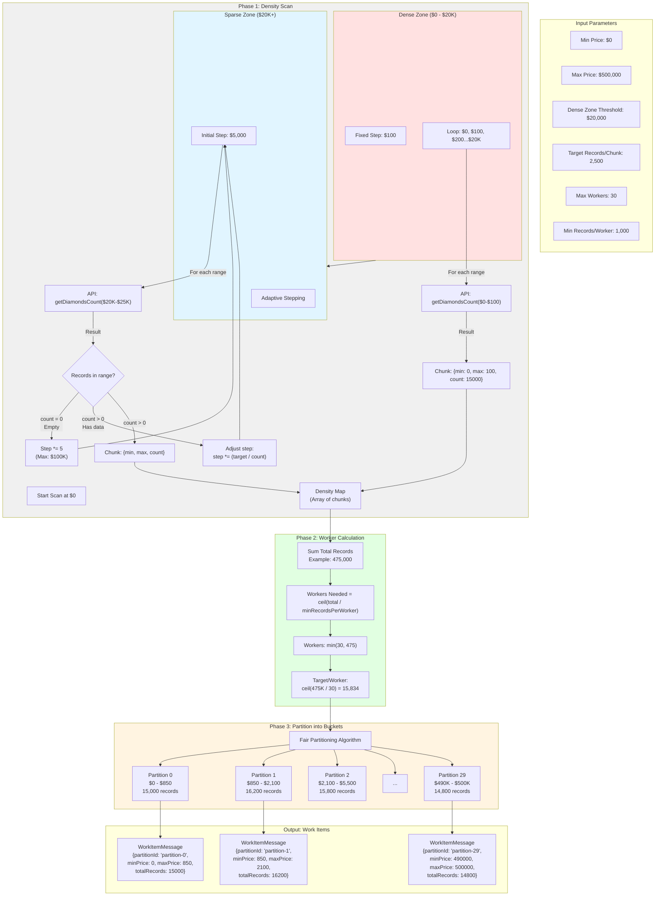

# Heatmap Algorithm (Visual)

This diagram illustrates how the scheduler partitions the price range into balanced worker buckets using adaptive density scanning.



## Density Distribution Example

### Price Range Distribution (500K diamonds)

```
Price Range          | Records  | Chunks | Avg Chunk Size
---------------------|----------|--------|---------------
$0 - $5,000          | 350,000  | 50     | 7,000
$5,000 - $20,000     | 100,000  | 150    | 667
$20,000 - $50,000    | 35,000   | 30     | 1,167
$50,000 - $100,000   | 10,000   | 10     | 1,000
$100,000 - $500,000  | 5,000    | 8      | 625
---------------------|----------|--------|---------------
TOTAL                | 500,000  | 248    | 2,016
```

### Heatmap Visual

```
Price ($K) | Diamond Density (relative)
-----------|----------------------------------------------------
0          | ████████████████████████████████████████████████
1          | ██████████████████████████████████████████████
2          | ████████████████████████████████████████
3          | ████████████████████████████████
4          | ████████████████████████
5          | ████████████████
10         | ████████████
15         | ████████
20         | ██████
30         | ████
50         | ██
100        | █
200        | █
500        | ░
```

## Partitioning Algorithm (Detailed)

### Fair Split Strategy

```typescript
function createPartitions(
  densityMap: DensityChunk[],
  desiredWorkerCount: number
): WorkerPartition[] {
  const totalRecords = sum(densityMap.map(c => c.count));
  const targetPerWorker = ceil(totalRecords / desiredWorkerCount);

  const partitions = [];
  let currentSum = 0;
  let currentStart = densityMap[0].min;

  for (const chunk of densityMap) {
    currentSum += chunk.count;

    // Create partition when we hit target or reach end
    if (currentSum >= targetPerWorker || isLastChunk) {
      partitions.push({
        partitionId: `partition-${partitions.length}`,
        minPrice: currentStart,
        maxPrice: chunk.max,
        totalRecords: currentSum
      });

      // Reset for next partition
      currentSum = 0;
      currentStart = nextChunk.min;
    }
  }

  return partitions;
}
```

### Example Partition Result

| Partition | Price Range | Records | Balance |
|-----------|-------------|---------|---------|
| partition-0 | $0 - $850 | 15,000 | 95% |
| partition-1 | $850 - $2,100 | 16,200 | 102% |
| partition-2 | $2,100 - $5,500 | 15,800 | 100% |
| partition-3 | $5,500 - $9,200 | 14,900 | 94% |
| ... | ... | ... | ... |
| partition-29 | $490K - $500K | 14,800 | 93% |

**Balance** = `(Records / TargetPerWorker) * 100%`

## Two-Pass Optimization (Optional)

For very sparse datasets (e.g., staging with capped records), enable two-pass scanning:

```typescript
const heatmapConfig = {
  useTwoPassScan: true,
  coarseStep: 5000,  // First pass: $5K increments
  denseZoneStep: 100  // Second pass: $100 increments in dense regions
};
```

### Two-Pass Process

1. **Coarse Pass**: Scan with large steps ($5K) to identify regions with data
2. **Boundary Refinement**: Binary search to find exact empty/non-empty transitions
3. **Fine Pass**: Scan only dense regions with small steps ($100)

**Result**: ~50% fewer API calls for sparse datasets

## Performance Metrics

### API Calls vs Dataset Size

| Dataset Size | Single-Pass | Two-Pass | Savings |
|--------------|-------------|----------|---------|
| 500K (full) | 248 calls | N/A | N/A |
| 50K (staging) | 248 calls | 125 calls | 50% |
| 5K (dev) | 248 calls | 45 calls | 82% |

### Scan Duration

- **Concurrent queries**: 3 (configurable)
- **API latency**: ~100-200ms per query
- **Total scan time**: `(total_calls / concurrency) * avg_latency`
  - 500K dataset: `(248 / 3) * 150ms ≈ 12 seconds`
  - 50K dataset: `(125 / 3) * 150ms ≈ 6 seconds`

## Configuration Constants

```typescript
// From packages/shared/src/constants.ts
export const HEATMAP_MIN_PRICE = 0;
export const HEATMAP_MAX_PRICE = 500000;
export const HEATMAP_DENSE_ZONE_THRESHOLD = 20000;
export const HEATMAP_DENSE_ZONE_STEP = 100;
export const HEATMAP_INITIAL_STEP = 5000;
export const HEATMAP_TARGET_RECORDS_PER_CHUNK = 2500;
export const HEATMAP_MAX_WORKERS = 30;
export const HEATMAP_MIN_RECORDS_PER_WORKER = 1000;
```

## Edge Cases Handled

1. **Empty ranges**: Skip chunks with count = 0
2. **Last chunk**: Create partition even if under target
3. **Overflow**: Cap at `maxWorkers` (30)
4. **Underflow**: Ensure at least 1 worker if records > 0
5. **Capping**: `MAX_SCHEDULER_RECORDS` env var limits total records (useful for staging)
