# Azure Infrastructure (Deployment)

This diagram shows the complete Azure infrastructure and how components are deployed.

```mermaid
graph TB
    subgraph Internet["Internet"]
        Users["API Clients"]
        DashboardUsers["Dashboard Users"]
    end

    subgraph AzureSubscription["Azure Subscription"]
        subgraph ResourceGroup["Resource Group: diamond-prod-rg"]

            subgraph ContainerAppsEnv["Container Apps Environment"]
                LogAnalytics["Log Analytics Workspace<br/>(Logs & Monitoring)"]

                subgraph APIApp["API Container App"]
                    APIReplicas["Replicas: 1-3<br/>CPU: 0.5<br/>Memory: 1Gi"]
                    APIIngress["External Ingress<br/>HTTPS (Auto TLS)<br/>Port: 3000"]
                end

                subgraph WorkerApp["Worker Container App"]
                    WorkerReplicas["Replicas: 0-30<br/>CPU: 0.5<br/>Memory: 1Gi<br/>(KEDA auto-scale)"]
                    WorkerScale["Scale Rule:<br/>azure-servicebus<br/>queue: work-items<br/>messageCount: 10"]
                end

                subgraph ConsolidatorApp["Consolidator Container App"]
                    ConsolidatorReplicas["Replicas: 1-3<br/>CPU: 1.0<br/>Memory: 2Gi<br/>(KEDA auto-scale)"]
                    ConsolidatorScale["Scale Rule:<br/>azure-servicebus<br/>queue: consolidate<br/>messageCount: 1"]
                end

                subgraph SchedulerJob["Scheduler Container Apps Job"]
                    SchedulerConfig["Cron: 0 2 * * *<br/>CPU: 0.5<br/>Memory: 1Gi<br/>Timeout: 1800s<br/>Retry: 1"]
                    SchedulerTrigger["Triggers:<br/>1. Cron (automatic)<br/>2. Manual (API call)"]
                end

                subgraph DashboardApp["Dashboard Container App"]
                    DashboardReplicas["Replicas: 1-2<br/>CPU: 0.25<br/>Memory: 0.5Gi"]
                    DashboardIngress["External Ingress<br/>HTTPS (Auto TLS)<br/>Port: 80"]
                end

                LogAnalytics -.->|Streams logs| APIApp
                LogAnalytics -.->|Streams logs| WorkerApp
                LogAnalytics -.->|Streams logs| ConsolidatorApp
                LogAnalytics -.->|Streams logs| SchedulerJob
                LogAnalytics -.->|Streams logs| DashboardApp
            end

            subgraph ServiceBus["Service Bus Namespace<br/>SKU: Standard"]
                WorkItemsQueue["Queue: work-items<br/>Lock: PT2M<br/>Max Delivery: 5<br/>Duplicate Detection: PT10M"]
                WorkDoneQueue["Queue: work-done<br/>Lock: PT1M<br/>Max Delivery: 3"]
                ConsolidateQueue["Queue: consolidate<br/>Lock: PT5M<br/>Max Delivery: 3"]
            end

            subgraph Storage["Storage Account<br/>Replication: LRS"]
                WatermarkContainer["Container: watermarks<br/>Blob: watermark.json<br/>Versioning: Enabled"]
            end

            subgraph ContainerRegistry["Container Registry<br/>SKU: Basic"]
                Images["Images:<br/>diamond-api:latest<br/>diamond-worker:latest<br/>diamond-consolidator:latest<br/>diamond-scheduler:latest<br/>diamond-dashboard:latest"]
            end

            subgraph IAM["Identity & Access"]
                APIManagedIdentity["API Managed Identity<br/>Role: Container App Job Operator"]
            end
        end

        subgraph ExternalDB["External (Supabase)"]
            PostgreSQL["PostgreSQL Database<br/>Host: aws-0-us-east-1.pooler.supabase.com<br/>Connection Pool: 15"]

            subgraph Tables["Tables"]
                RawDiamondsTable["raw_diamonds_nivoda<br/>(Raw JSON, run_id indexed)"]
                DiamondsTable["diamonds<br/>(Canonical, supplier_stone_id PK)"]
                PricingRulesTable["pricing_rules<br/>(Priority-based rules)"]
                RunMetadataTable["run_metadata<br/>(Run tracking, counters)"]
                WorkerRunsTable["worker_runs<br/>(Worker status)"]
                PartitionProgressTable["partition_progress<br/>(Idempotency, CAS)"]
                APIKeysTable["api_keys<br/>(SHA256 hashed)"]
            end
        end

        subgraph ExternalAPIs["External APIs"]
            Nivoda["Nivoda GraphQL API<br/>graphql-lab.nivoda.net<br/>Token auth: 6h lifetime"]
            Resend["Resend API<br/>(Alert emails)"]
        end
    end

    subgraph CICD["CI/CD (GitHub Actions)"]
        GitHubActions["GitHub Actions<br/>.github/workflows/"]

        subgraph Workflows["Workflows"]
            BuildWorkflow["build.yml<br/>(Build & push images)"]
            DeployWorkflow["deploy.yml<br/>(Update container apps)"]
        end
    end

    Users -->|HTTPS| APIIngress
    DashboardUsers -->|HTTPS| DashboardIngress

    APIApp -->|Query/Write| PostgreSQL
    WorkerApp -->|Write raw data| PostgreSQL
    ConsolidatorApp -->|Read/Transform/Write| PostgreSQL
    SchedulerJob -->|Create run metadata| PostgreSQL

    APIApp -->|Read| WatermarkContainer
    SchedulerJob -->|Read| WatermarkContainer
    ConsolidatorApp -->|Write| WatermarkContainer

    SchedulerJob -->|Enqueue| WorkItemsQueue
    WorkerApp -->|Consume| WorkItemsQueue
    WorkerApp -->|Enqueue continuation| WorkItemsQueue
    WorkerApp -->|Send| WorkDoneQueue
    WorkerApp -->|Trigger| ConsolidateQueue
    ConsolidatorApp -->|Consume| ConsolidateQueue

    WorkerApp -->|KEDA Scale| WorkItemsQueue
    ConsolidatorApp -->|KEDA Scale| ConsolidateQueue

    SchedulerJob -->|Count queries| Nivoda
    WorkerApp -->|Fetch diamonds| Nivoda
    ConsolidatorApp -->|Send alerts| Resend

    APIApp -->|Trigger job| SchedulerJob
    APIManagedIdentity -.->|Authorize| SchedulerJob

    ContainerRegistry -->|Pull images| APIApp
    ContainerRegistry -->|Pull images| WorkerApp
    ContainerRegistry -->|Pull images| ConsolidatorApp
    ContainerRegistry -->|Pull images| SchedulerJob
    ContainerRegistry -->|Pull images| DashboardApp

    GitHubActions -->|Build & push| ContainerRegistry
    GitHubActions -->|Deploy| ContainerAppsEnv

    style ContainerAppsEnv fill:#e1f5ff
    style ServiceBus fill:#fff4e1
    style Storage fill:#f0f0f0
    style ExternalDB fill:#ffe1e1
    style ExternalAPIs fill:#ffcccc
    style CICD fill:#e1ffe1
```



## Infrastructure Components

### Container Apps Environment

**Purpose**: Managed Kubernetes environment for microservices

| Component | Type | Scaling | Resources | Cost/Month |
|-----------|------|---------|-----------|------------|
| API | Container App | 1-3 replicas | 0.5 vCPU, 1 GiB | ~$15-45 |
| Worker | Container App | 0-30 replicas | 0.5 vCPU, 1 GiB | ~$0-450 |
| Consolidator | Container App | 1-3 replicas | 1.0 vCPU, 2 GiB | ~$60-180 |
| Scheduler | Container Apps Job | On-demand | 0.5 vCPU, 1 GiB | ~$1-2 |
| Dashboard | Container App | 1-2 replicas | 0.25 vCPU, 0.5 GiB | ~$8-15 |

**Total Estimated**: ~$84-692/month (scales with load)

### Service Bus

**Purpose**: Message queuing for async processing

| Queue | Purpose | Settings | Cost Factor |
|-------|---------|----------|-------------|
| work-items | Worker task distribution | Lock: 2 min, Max delivery: 5 | Message count × operations |
| work-done | Worker completion tracking | Lock: 1 min, Max delivery: 3 | Low volume |
| consolidate | Consolidation trigger | Lock: 5 min, Max delivery: 3 | Low volume |

**SKU**: Standard ($10/month base + $0.05 per million operations)
**Estimated**: ~$15-30/month

### Storage Account

**Purpose**: Watermark persistence

| Resource | Size | Purpose | Versioning |
|----------|------|---------|------------|
| watermark.json | <1 KB | Last successful run timestamp | Enabled (30 days) |

**Replication**: LRS (Locally Redundant Storage)
**Estimated**: ~$1/month

### Container Registry

**Purpose**: Docker image storage

| Registry | SKU | Storage | Bandwidth |
|----------|-----|---------|-----------|
| diamondprodacr | Basic | 10 GB | 100 GB/month |

**Images**:
- `diamond-api:latest`, `diamond-api:<commit-sha>`
- `diamond-worker:latest`, `diamond-worker:<commit-sha>`
- `diamond-consolidator:latest`, `diamond-consolidator:<commit-sha>`
- `diamond-scheduler:latest`, `diamond-scheduler:<commit-sha>`
- `diamond-dashboard:latest`, `diamond-dashboard:<commit-sha>`

**Estimated**: ~$5/month

### Log Analytics Workspace

**Purpose**: Centralized logging and monitoring

| Feature | Configuration | Retention |
|---------|---------------|-----------|
| Container logs | All stdout/stderr | 30 days |
| Query language | KQL (Kusto) | Real-time |
| Alerts | Configurable | N/A |

**Estimated**: ~$2-10/month (based on data volume)

## Network Architecture

### Ingress (Public)

```
Internet → Azure Front Door (optional) → Container App Ingress
  ↓
HTTPS (TLS auto-managed)
  ↓
Load Balancer → API Replicas (3 max)
```

**Endpoints**:
- `https://diamond-prod-api.azurecontainerapps.io` (API)
- `https://diamond-prod-dashboard.azurecontainerapps.io` (Dashboard)

### Internal Communication

```
Container Apps ←→ Service Bus (Private Endpoint - optional)
Container Apps ←→ Storage Account (Private Endpoint - optional)
Container Apps ←→ Supabase PostgreSQL (Public, TLS encrypted)
```

**Security**:
- All secrets stored in Container App secrets (encrypted at rest)
- Managed Identity for Azure resource access
- TLS 1.2+ enforced for all connections

## Auto-Scaling Configuration

### Worker Auto-Scale (KEDA)

```yaml
custom_scale_rule:
  name: servicebus-work-items-scale
  type: azure-servicebus
  metadata:
    namespace: diamond-prod-servicebus
    queueName: work-items
    messageCount: "10"           # Scale when 10+ messages per replica
    activationMessageCount: "0"  # Always activate if messages exist
```

**Behavior**:
- 0 messages → Scale to 0 (no cost)
- 1-10 messages → 1 replica
- 11-20 messages → 2 replicas
- 290-300 messages → 30 replicas (max)

### Consolidator Auto-Scale (KEDA)

```yaml
custom_scale_rule:
  name: servicebus-consolidate-scale
  type: azure-servicebus
  metadata:
    namespace: diamond-prod-servicebus
    queueName: consolidate
    messageCount: "1"            # Scale when 1+ messages per replica
    activationMessageCount: "0"  # Always activate
```

**Behavior**:
- 0 messages → Scale to 1 (minimum, ready)
- 1 message → 1 replica
- 2 messages → 2 replicas
- 3 messages → 3 replicas (max)

## Environment Variables

### API Container

```env
PORT=3000
DATABASE_HOST=<supabase-host>
DATABASE_PORT=5432
DATABASE_NAME=postgres
DATABASE_USERNAME=<username>
DATABASE_PASSWORD=<secret>
AZURE_STORAGE_CONNECTION_STRING=<secret>
AZURE_SERVICE_BUS_CONNECTION_STRING=<secret>
HMAC_SECRETS=<secret-json>
AZURE_SUBSCRIPTION_ID=<azure-sub-id>
AZURE_RESOURCE_GROUP=diamond-prod-rg
AZURE_SCHEDULER_JOB_NAME=diamond-prod-scheduler
```

### Worker Container

```env
DATABASE_HOST=<supabase-host>
DATABASE_PORT=5432
DATABASE_NAME=postgres
DATABASE_USERNAME=<username>
DATABASE_PASSWORD=<secret>
AZURE_STORAGE_CONNECTION_STRING=<secret>
AZURE_SERVICE_BUS_CONNECTION_STRING=<secret>
NIVODA_ENDPOINT=https://graphql-lab.nivoda.net/graphql
NIVODA_USERNAME=<secret>
NIVODA_PASSWORD=<secret>
```

### Consolidator Container

```env
DATABASE_HOST=<supabase-host>
DATABASE_PORT=5432
DATABASE_NAME=postgres
DATABASE_USERNAME=<username>
DATABASE_PASSWORD=<secret>
AZURE_STORAGE_CONNECTION_STRING=<secret>
AZURE_SERVICE_BUS_CONNECTION_STRING=<secret>
RESEND_API_KEY=<secret>
ALERT_EMAIL_TO=alerts@example.com
ALERT_EMAIL_FROM=noreply@example.com
```

### Scheduler Job

```env
DATABASE_HOST=<supabase-host>
DATABASE_PORT=5432
DATABASE_NAME=postgres
DATABASE_USERNAME=<username>
DATABASE_PASSWORD=<secret>
AZURE_STORAGE_CONNECTION_STRING=<secret>
AZURE_SERVICE_BUS_CONNECTION_STRING=<secret>
NIVODA_ENDPOINT=https://graphql-lab.nivoda.net/graphql
NIVODA_USERNAME=<secret>
NIVODA_PASSWORD=<secret>
MAX_SCHEDULER_RECORDS=0  # 0 = unlimited (use for staging cap)
```

### Dashboard Container

```env
API_URL=https://diamond-prod-api.azurecontainerapps.io
```

## Deployment Process

### Terraform Modules

```
infrastructure/terraform/
├── modules/
│   ├── service-bus/       # Queues, authorization rules
│   ├── storage/           # Blob storage, containers
│   ├── container-registry/# ACR configuration
│   └── container-apps/    # Apps, jobs, environment
└── environments/
    ├── prod/              # Production configuration
    └── staging/           # Staging configuration
```

### Deployment Steps

```bash
# 1. Build Docker images
docker build -t diamondprodacr.azurecr.io/diamond-api:latest -f docker/api.Dockerfile .
docker build -t diamondprodacr.azurecr.io/diamond-worker:latest -f docker/worker.Dockerfile .
docker build -t diamondprodacr.azurecr.io/diamond-consolidator:latest -f docker/consolidator.Dockerfile .
docker build -t diamondprodacr.azurecr.io/diamond-scheduler:latest -f docker/scheduler.Dockerfile .
docker build -t diamondprodacr.azurecr.io/diamond-dashboard:latest -f docker/dashboard.Dockerfile .

# 2. Push to ACR
az acr login --name diamondprodacr
docker push diamondprodacr.azurecr.io/diamond-api:latest
docker push diamondprodacr.azurecr.io/diamond-worker:latest
docker push diamondprodacr.azurecr.io/diamond-consolidator:latest
docker push diamondprodacr.azurecr.io/diamond-scheduler:latest
docker push diamondprodacr.azurecr.io/diamond-dashboard:latest

# 3. Apply Terraform
cd infrastructure/terraform/environments/prod
terraform init
terraform plan
terraform apply

# 4. Update container apps (triggers rolling restart)
az containerapp update --name diamond-prod-api --resource-group diamond-prod-rg --image diamondprodacr.azurecr.io/diamond-api:latest
```

### GitHub Actions CI/CD

```yaml
# .github/workflows/deploy.yml
name: Deploy to Azure
on:
  push:
    branches: [main]

jobs:
  deploy:
    runs-on: ubuntu-latest
    steps:
      - uses: actions/checkout@v3
      - name: Build & push images
        run: |
          docker build -t $ACR_NAME/diamond-api:$GITHUB_SHA -f docker/api.Dockerfile .
          docker push $ACR_NAME/diamond-api:$GITHUB_SHA
      - name: Update container apps
        run: |
          az containerapp update --image $ACR_NAME/diamond-api:$GITHUB_SHA
```

## Monitoring & Observability

### Log Analytics Queries (KQL)

```kql
// View worker errors in last hour
ContainerAppConsoleLogs_CL
| where ContainerName_s == "worker"
| where Level_s == "error"
| where TimeGenerated > ago(1h)
| project TimeGenerated, Message_s, runId_s, partitionId_s

// Monitor queue depths
// (Use Azure Service Bus metrics)
```

### Key Metrics to Monitor

| Metric | Alert Threshold | Action |
|--------|-----------------|--------|
| Dead letter queue count | > 0 | Review messages, retry |
| Worker error rate | > 5% | Check Nivoda API, DB connectivity |
| Consolidator failures | > 1 per day | Review logs, check pricing rules |
| API 5xx errors | > 1% | Check DB connectivity, auth config |
| Watermark age | > 48 hours | Check scheduler cron, manual trigger |

## Cost Optimization

### Production (500K diamonds)

| Component | Monthly Cost |
|-----------|--------------|
| Container Apps | $200-400 |
| Service Bus | $15-30 |
| Storage | $1 |
| Container Registry | $5 |
| Log Analytics | $5-15 |
| Supabase (external) | $25-100 |
| **Total** | **$251-551** |

### Cost Saving Tips

1. **Scale workers to 0** when idle (KEDA auto-scale)
2. **Use staging environment** with `MAX_SCHEDULER_RECORDS` cap
3. **Reduce log retention** to 7 days (from 30)
4. **Use Basic tier** for Container Registry (not Premium)
5. **Monitor consolidator replicas** (can run with 1 if volume is low)
