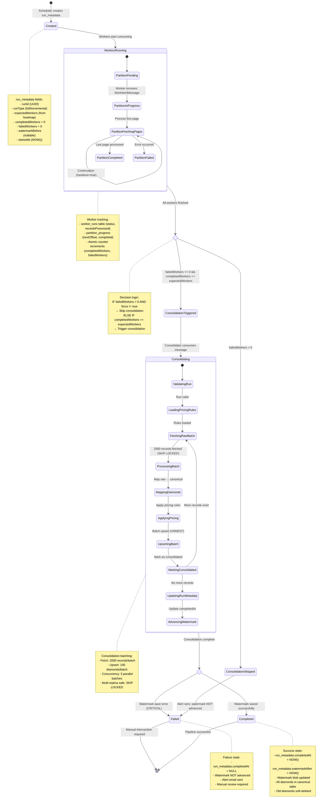
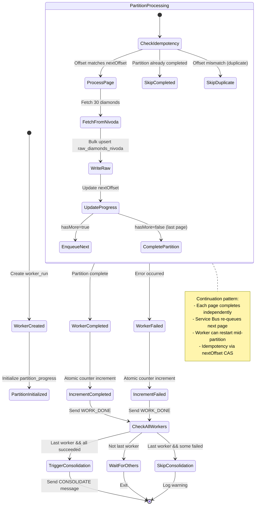
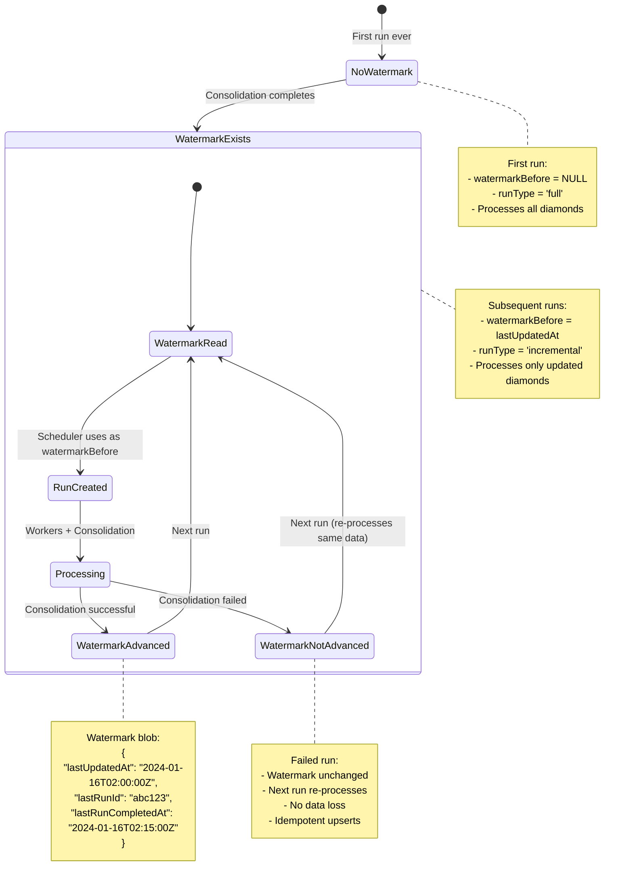

# State Machine (Run Lifecycle)

This diagram shows the complete state machine for a pipeline run from creation to completion.



## Run Metadata State Transitions

### Database Schema

```sql
CREATE TABLE run_metadata (
  run_id UUID PRIMARY KEY,
  run_type TEXT NOT NULL,                    -- 'full' | 'incremental'
  expected_workers INTEGER NOT NULL,
  completed_workers INTEGER DEFAULT 0,
  failed_workers INTEGER DEFAULT 0,
  watermark_before TIMESTAMP WITH TIME ZONE, -- nullable for first run
  watermark_after TIMESTAMP WITH TIME ZONE,  -- set on completion
  started_at TIMESTAMP WITH TIME ZONE DEFAULT NOW(),
  completed_at TIMESTAMP WITH TIME ZONE      -- NULL until consolidation completes
);
```

### State Field Values

| State | completed_workers | failed_workers | completed_at | watermark_after |
|-------|-------------------|----------------|--------------|-----------------|
| Created | 0 | 0 | NULL | NULL |
| WorkersRunning | 0-N | 0-M | NULL | NULL |
| ConsolidationSkipped | N | M > 0 | NULL | NULL |
| Consolidating | N | 0 | NULL | NULL |
| Completed | N | 0 | NOW() | NOW() |
| Failed | * | * | NULL | NULL |

## Worker State Machine

Each worker partition goes through its own lifecycle:



### Worker Run States

```sql
CREATE TABLE worker_runs (
  id UUID PRIMARY KEY,
  run_id UUID NOT NULL REFERENCES run_metadata(run_id),
  partition_id TEXT NOT NULL,
  worker_id TEXT NOT NULL,
  status TEXT NOT NULL,               -- 'running' | 'completed' | 'failed'
  records_processed INTEGER DEFAULT 0,
  error_message TEXT,
  work_item_payload JSONB,
  started_at TIMESTAMP WITH TIME ZONE DEFAULT NOW(),
  completed_at TIMESTAMP WITH TIME ZONE,
  UNIQUE(run_id, partition_id)       -- Only one worker per partition
);
```

## Partition Progress State

Tracks continuation state for each partition:

```sql
CREATE TABLE partition_progress (
  run_id UUID NOT NULL,
  partition_id TEXT NOT NULL,
  next_offset INTEGER NOT NULL DEFAULT 0,  -- Next page to process
  completed BOOLEAN NOT NULL DEFAULT FALSE,
  created_at TIMESTAMP WITH TIME ZONE DEFAULT NOW(),
  updated_at TIMESTAMP WITH TIME ZONE DEFAULT NOW(),
  PRIMARY KEY (run_id, partition_id)
);
```

### CAS (Compare-And-Swap) Updates

```sql
-- Idempotent offset update
UPDATE partition_progress
SET next_offset = $newOffset,
    updated_at = NOW()
WHERE run_id = $runId
  AND partition_id = $partitionId
  AND next_offset = $expectedOffset  -- CAS: only update if matches
  AND NOT completed;

-- Returns 1 if updated, 0 if mismatch (skip duplicate)
```

## Counter Increments (Atomic)

```sql
-- Increment completed workers (atomic)
UPDATE run_metadata
SET completed_workers = completed_workers + 1
WHERE run_id = $runId
RETURNING completed_workers, expected_workers, failed_workers;

-- Increment failed workers (atomic)
UPDATE run_metadata
SET failed_workers = failed_workers + 1
WHERE run_id = $runId
RETURNING completed_workers, expected_workers, failed_workers;
```

## Watermark State Machine



## Complete Run Example

### Timeline for 500K Records (30 Workers)

```
Time   | State                          | Details
-------|--------------------------------|------------------------------------------
00:00  | Created                        | Scheduler creates run_metadata (runId: abc123)
00:00  | Heatmap Scanning              | Scheduler scans price ranges (30-60 API calls)
00:01  | Workers Enqueued              | 30 WorkItemMessages sent to work-items queue
00:01  | WorkersRunning (partition-0)  | Worker 1 starts partition-0, creates worker_run
00:01  | PartitionFetchingPages        | Worker 1 processes pages 0, 30, 60...4970
00:05  | PartitionCompleted            | Worker 1 completes partition-0 (5000 records)
00:05  | IncrementCompleted            | completedWorkers = 1/30
00:05  | WORK_DONE sent                | Worker 1 sends completion message
...    | ...                           | Workers 2-29 process in parallel
00:10  | Last Worker Completes         | Worker 30 finishes partition-29
00:10  | IncrementCompleted            | completedWorkers = 30/30, failedWorkers = 0
00:10  | ConsolidationTriggered        | Worker 30 sends CONSOLIDATE message
00:10  | Consolidating                 | Consolidator starts processing
00:10  | FetchingRawBatch              | Batch 1: 2000 raw diamonds (SKIP LOCKED)
00:11  | ProcessingBatch               | Map → Price → Upsert (5 concurrent chunks)
00:11  | MarkingConsolidated           | Mark 2000 as consolidated
00:11  | FetchingRawBatch              | Batch 2: 2000 raw diamonds
...    | ...                           | 250 batches total (500K / 2000)
00:15  | UpdatingRunMetadata           | Set completedAt, watermarkAfter
00:15  | AdvancingWatermark            | Update Azure Blob watermark.json
00:15  | Completed                     | Pipeline successful
```

### Query Run Status

```sql
-- Get current run status
SELECT
  run_id,
  run_type,
  completed_workers || '/' || expected_workers AS progress,
  failed_workers,
  CASE
    WHEN completed_at IS NOT NULL THEN 'completed'
    WHEN failed_workers > 0 THEN 'failed'
    WHEN completed_workers < expected_workers THEN 'in_progress'
    ELSE 'consolidating'
  END AS status,
  started_at,
  completed_at,
  EXTRACT(EPOCH FROM (COALESCE(completed_at, NOW()) - started_at)) / 60 AS duration_minutes
FROM run_metadata
WHERE run_id = 'abc123';

-- Get worker breakdown
SELECT
  partition_id,
  status,
  records_processed,
  error_message,
  started_at,
  completed_at
FROM worker_runs
WHERE run_id = 'abc123'
ORDER BY partition_id;

-- Get partition progress
SELECT
  partition_id,
  next_offset,
  completed,
  updated_at
FROM partition_progress
WHERE run_id = 'abc123'
ORDER BY partition_id;
```

## State Transition Triggers

### Scheduler → Created

```typescript
const runMetadata = await createRunMetadata(
  runType,           // 'full' | 'incremental'
  workerCount,       // From heatmap (e.g., 30)
  watermarkBefore    // From Azure Blob (nullable)
);
```

### Worker → IncrementCompleted

```typescript
const { completedWorkers, expectedWorkers, failedWorkers } =
  await incrementCompletedWorkers(runId);

// Last worker triggers consolidation
if (completedWorkers === expectedWorkers && failedWorkers === 0) {
  await sendConsolidate({ type: "CONSOLIDATE", runId, traceId });
}
```

### Worker → IncrementFailed

```typescript
const { failedWorkers } = await incrementFailedWorkers(runId);
// Consolidation will be skipped (no CONSOLIDATE message sent)
```

### Consolidator → Completed

```typescript
const now = new Date();

// Update run_metadata
await completeRun(runId, now);

// Advance watermark
const watermark = {
  lastUpdatedAt: now.toISOString(),
  lastRunId: runId,
  lastRunCompletedAt: now.toISOString(),
};
await saveWatermark(watermark);
```

### Consolidator → Failed

```typescript
// On error: Do NOT call completeRun() or saveWatermark()
await sendAlert(
  "Consolidation Failed",
  `Run ${runId} failed. Watermark NOT advanced.`
);
// Service Bus will retry (max 3 attempts)
```

## Monitoring Queries

### Dashboard Live Status

```sql
-- Active runs
SELECT
  run_id,
  run_type,
  completed_workers,
  expected_workers,
  failed_workers,
  started_at,
  NOW() - started_at AS elapsed
FROM run_metadata
WHERE completed_at IS NULL
ORDER BY started_at DESC;

-- Recent runs (last 24 hours)
SELECT
  run_id,
  run_type,
  completed_workers || '/' || expected_workers AS progress,
  CASE
    WHEN completed_at IS NOT NULL THEN 'completed'
    WHEN failed_workers > 0 THEN 'failed'
    ELSE 'in_progress'
  END AS status,
  started_at,
  completed_at,
  EXTRACT(EPOCH FROM (COALESCE(completed_at, NOW()) - started_at)) / 60 AS duration_minutes
FROM run_metadata
WHERE started_at > NOW() - INTERVAL '24 hours'
ORDER BY started_at DESC;
```

### Failed Run Analysis

```sql
-- Find failed workers
SELECT
  wr.partition_id,
  wr.records_processed,
  wr.error_message,
  wr.started_at,
  wr.completed_at
FROM worker_runs wr
JOIN run_metadata rm ON wr.run_id = rm.run_id
WHERE rm.run_id = 'abc123'
  AND wr.status = 'failed'
ORDER BY wr.started_at;

-- Check partition progress at failure
SELECT
  partition_id,
  next_offset,
  completed
FROM partition_progress
WHERE run_id = 'abc123'
  AND NOT completed;
```
